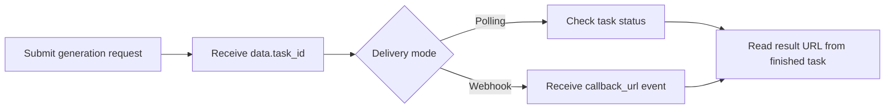

# Runway Gen-4.5 API with APIDot

Build with the Runway Gen-4.5 API using APIDot: cURL, Node.js, polling, webhooks, pricing, and production notes in one GitHub repo.

[Try on APIDot](https://apidot.ai/models/runway-gen-4-5) | [Get API Key](https://apidot.ai/dashboard/api-key) | [API Docs](https://apidot.ai/docs/runway-gen-4-5) | [Pricing](https://apidot.ai/pricing) | [Main Examples](https://github.com/APIDotAI/apidot-examples)

## Why this repo exists

Runway Gen-4.5 video generation for cinematic prompt-driven and optional single-image-guided clips with 5 or 10 second duration and multiple aspect ratios.

This repository turns the APIDot workflow into runnable server-side examples: a verified cURL request, a native Node.js polling example, webhook receiver notes, prompt examples, pricing context, and production integration guardrails.

## Overview

Runway Gen-4.5 uses APIDot's shared async generation workflow. Send `model: "runway-gen-4.5"`, an optional `callback_url`, and supported video parameters inside `input`. The current APIDot endpoint supports prompt-based video generation with optional single-image guidance; text-only jobs support `16:9` and `9:16`, while jobs with one image URL support the full aspect-ratio set.

## Capabilities

- Write prompts that describe subject action, camera movement, lighting, pacing, and visual style.
- Use `duration: 5` for fast concept checks and `duration: 10` when the shot needs more time to develop.
- Use `aspect_ratio: "16:9"` or `"9:16"` for text-only generation; add one `input.image_urls` item before using `4:3`, `3:4`, `1:1`, or `21:9`.
- Use one image URL in `input.image_urls` when a product, character, composition, or style should anchor the clip.
- Do not send audio, video-to-video, multi-image, keyframe, or long-form stitching fields to this endpoint.

## Common use cases

- Product and marketing video generation
- Social-first creative testing
- Storyboard previews and prompt iteration
- Backend media workflow prototypes
- Production queues that need polling or webhooks

## Pricing on APIDot

Catalog price: Starting at 75 credits per video | 5s: 75 credits ($0.375), 10s: 150 credits ($0.750).

| Tier | Model | Resolution | Credits | APIDot listed price | fal.ai listed price |
| --- | --- | --- | ---: | ---: | ---: |
| 5s video generation | runway-gen-4.5 | - | 75 | $0.375 | - |
| 10s video generation | runway-gen-4.5 | - | 150 | $0.75 | - |

This README uses pricing data currently published in the APIDot model catalog. Check the APIDot model page before high-volume production runs.

## Quick start

    cp .env.example .env
    # Edit .env and set APIDOT_API_KEY
    cd node
    npm start

The same request shape is available as a copy-paste cURL example in curl/generate.md.

## API workflow



Use polling for local tests and webhook delivery for production queues. Store `data.task_id` before the first status check so retries, callbacks, and result URLs can be reconciled safely.

## Minimal API request

Submit to APIDot's unified async generation endpoint:

    POST https://api.apidot.ai/api/generate/submit
    Authorization: Bearer <APIDOT_API_KEY>
    Content-Type: application/json

Primary payload:

```json
{
  "model": "runway-gen-4.5",
  "input": {
    "prompt": "A luxury watch rotates on black marble as water droplets ripple outward, macro cinematic lighting, slow push-in, realistic reflections",
    "duration": 5,
    "aspect_ratio": "16:9"
  }
}
```

Submit Runway Gen-4.5 text-to-video or single-image-guided video jobs through APIDot's unified async generation endpoint.

## Model IDs and request variants

### Text to video

```json
{
  "model": "runway-gen-4.5",
  "callback_url": "https://your-domain.com/callback",
  "input": {
    "prompt": "A luxury watch rotates on black marble as water droplets ripple outward, macro cinematic lighting, slow push-in, realistic reflections",
    "duration": 5,
    "aspect_ratio": "16:9"
  }
}
```

### Single-image guided video

```json
{
  "model": "runway-gen-4.5",
  "callback_url": "https://your-domain.com/callback",
  "input": {
    "prompt": "Animate the product into a premium launch shot with a slow camera orbit, soft studio reflections, and subtle atmospheric motion",
    "duration": 10,
    "aspect_ratio": "1:1",
    "image_urls": [
      "https://your-domain.com/reference-image.webp"
    ],
    "seed": 12345
  }
}
```

## Request parameters

| Field | Type | Required | Description |
| --- | --- | --- | --- |
| model | string | yes | Target model id. Use `runway-gen-4.5`. |
| callback_url | string | no | Optional webhook callback URL for terminal task updates. |
| input.prompt | string | yes | Primary video prompt describing the scene, subject, motion, camera direction, lighting, pacing, and visual style. |
| input.duration | number | no | Video duration in seconds. Supported values are `5` and `10`. |
| input.aspect_ratio | string | no | Output aspect ratio. Text-only requests support `16:9` and `9:16`. Requests with one valid `input.image_urls` item also support `4:3`, `3:4`, `1:1`, and `21:9`. |
| input.image_urls | string[] | no | Optional reference image URL array for image-guided video generation. Use at most one image URL. |
| input.seed | number | no | Optional integer seed for more repeatable prompt and setting exploration. |

## Practical integration notes

- Keep APIDot API keys in server-side environment variables.
- Persist task_id, selected model, request payload, user ID, and status together.
- Poll at a moderate interval for local tests and use webhooks for durable production callbacks.
- Validate source media URLs before submitting requests that depend on source files.
- Avoid logging API keys, private prompts, private media URLs, or callback URLs.

## Polling and webhooks

APIDot media generation is asynchronous. Store `data.task_id` immediately after submit, poll `/api/generate/status/{task_id}` for local tests, and use `callback_url` webhooks for production queues where users may leave the page before completion.

Webhook handlers should verify task ownership, persist callback events, return 2xx quickly, and be idempotent because duplicate deliveries can happen.

## Response and errors

- `code`: HTTP-style status code. Successful submits return `200`.
- `data.task_id`: Async task identifier returned immediately after submission.
- `data.status`: Initial task status, typically `not_started`.
- `data.created_time`: ISO 8601 timestamp for task creation.

Common error classes:

- `400 invalid_request`: Missing fields or unsupported parameter combinations.
- `401 authentication_error`: Missing, expired, or invalid Bearer API key.
- `402 insufficient_credits`: The current prepaid balance cannot cover the job.
- `429 rate_limited`: Submission rate is temporarily above the current allowed limit.

## Production notes

- Keep APIDot API keys in server-side environment variables.
- Persist task_id, selected model, request payload, user ID, and status together.
- Use a moderate polling interval for tests and webhooks for durable production callbacks.
- Validate source media URLs before submitting requests that depend on source files.
- Avoid logging API keys, private prompts, private media URLs, or callback URLs.
- Retry transient network failures with backoff, but do not retry unchanged invalid payloads.

## FAQ

### Which model id should I send?

Use `runway-gen-4.5` in the top-level `model` field.

### How do I switch from text-to-video to image-guided generation?

Keep the same endpoint and model id, then add one image URL in `input.image_urls`. Once an image URL is present, aspect ratios beyond `16:9` and `9:16` become available.

### Which aspect ratios can I use without an image?

Text-only generation supports `16:9` and `9:16`. Add one valid `input.image_urls` item to use `4:3`, `3:4`, `1:1`, or `21:9`.

### Can I include more than one image?

No. The current APIDot Runway Gen-4.5 endpoint accepts at most one image URL.

### How does delivery work?

Submit the job, store the returned `task_id`, then poll `/api/generate/status/{task_id}` or use `callback_url` for terminal task updates.

## Related links

- Website: https://apidot.ai
- Docs: https://apidot.ai/docs
- Runway Gen-4.5 docs: https://apidot.ai/docs/runway-gen-4-5
- Runway Gen-4.5 model page: https://apidot.ai/models/runway-gen-4-5
- GitHub repo: https://github.com/APIDotAI/runway-gen-4-5-api
- Main examples: https://github.com/APIDotAI/apidot-examples
